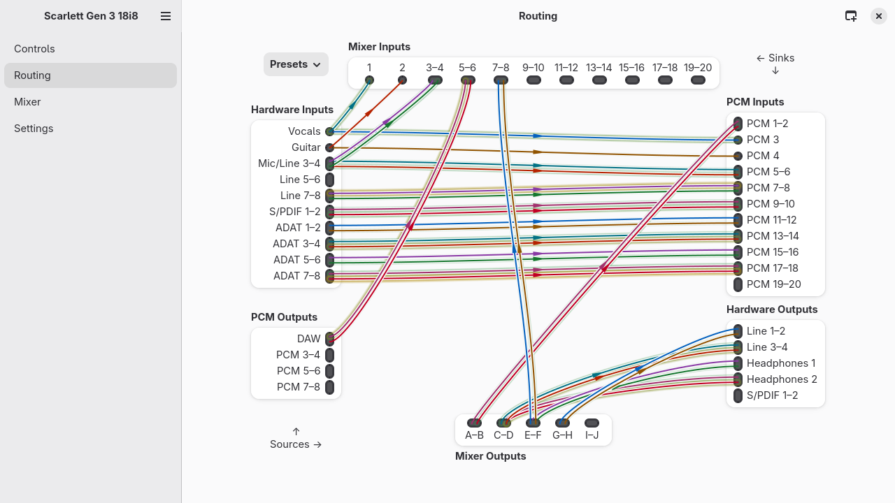
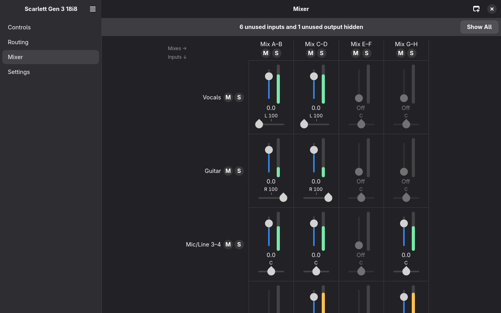

# Vermilion

A control panel for Focusrite Scarlett, Clarett and Vocaster USB audio
interfaces on Linux: routing, mixer, levels and the settings of the
interface, for the GNOME desktop.

Vermilion is an AI-assisted port of
[alsa-scarlett-gui](https://github.com/geoffreybennett/alsa-scarlett-gui)
by Geoffrey D. Bennett to Python, GTK 4 and libadwaita.

The name: vermilion is a bright red, the colour of these interfaces, so
the name points to them without borrowing Focusrite’s product names.





## Installation

Vermilion needs Python >= 3.14, GTK 4 and libadwaita (Fedora 44 or
newer), and PyGObject and pycairo from the distribution:

```sh
sudo dnf install python3-gobject python3-cairo gtk4 libadwaita alsa-lib
pipx install --system-site-packages vermilion
```

The kernel driver and firmware prerequisites are those of the original,
see its [documentation](https://github.com/geoffreybennett/alsa-scarlett-gui/blob/master/docs/INSTALL.md).
Vermilion doesn't update firmware.

The Scarlett 4th Gen 16i16, 18i16 and 18i20 are not supported yet: they
use the Focusrite Control Protocol (FCP) driver, whose controls come
from a user-space driver that Vermilion doesn't implement yet (their
demos can be simulated, though).

## Running from the source tree

```sh
uv venv --system-site-packages   # PyGObject comes from the system
uv sync
just blueprints                  # compile the user interface
uv run vermilion
```

Simulated interfaces can be opened from `.state` files:

```sh
uv run vermilion demo/"Scarlett Gen 4 18i20.state"
```

`vermilion-config` loads a saved `.conf` configuration into a device
from the command line (`uv run vermilion-config --help`).

Log messages go to the journal (or stderr); debug messages are shown
with `G_MESSAGES_DEBUG=vermilion`.

## Files

Following the [XDG Base Directory
Specification](https://specifications.freedesktop.org/basedir-spec/latest/),
per device (by serial number):

| File | Contents |
|---|---|
| `$XDG_STATE_HOME/vermilion/<serial>.conf` | port names, stereo links, mute/solo and the other controls the driver lacks; the window layout |
| `$XDG_STATE_HOME/vermilion/<serial>-device.conf` | the controls of the interface as last seen, to undo the system’s ALSA state service (alsa-restore) |
| `$XDG_CONFIG_HOME/vermilion/<serial>.conf` | preferences |
| `$XDG_DATA_HOME/vermilion/presets/<serial>-<name>.conf` | presets |

The defaults are `~/.local/state`, `~/.config` and `~/.local/share`.

## Development

With [just](https://just.systems/):

```sh
just check    # all linters and the tests
just lint     # ruff, mypy (strict), ty and reuse
just test     # pytest (arguments are passed on)
just fmt      # format the code
just blueprints  # compile the Blueprint files
just build    # sdist and wheel in dist/
```

The user interface is described in Blueprint files
(`src/vermilion/ui/blueprints/*.blp`). The application loads the
GtkBuilder XML compiled from them (`*.ui`), so it doesn't need
blueprint-compiler; the `.ui` files are not checked in but part of the
package. After cloning and after changing a `.blp` file, run
`just blueprints` (`just test` and `just build` do so first).

`tools/screenshot.py` renders every view of simulated interfaces to PNG
files without opening windows on the desktop (with a private GTK
Broadway display server, `gtk4-broadwayd`):

```sh
uv run tools/screenshot.py /tmp/shots demo/*.state
```

## License

GPL-3.0-or-later, as the original. Copyright 2022-2026 Geoffrey D.
Bennett (original C implementation), 2026 Stefan Tatschner (Python
port). The project follows the [REUSE](https://reuse.software/)
specification.
